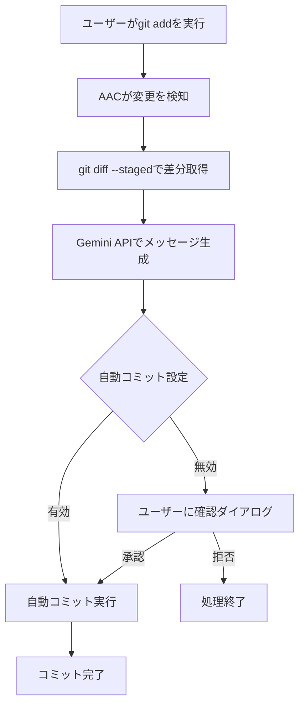

# AAC (AutoAiCommit)

AIによる自動コミットメッセージ生成で、開発効率を向上させるVSCode拡張機能です。

## 特徴

- **AI自動生成**: Gemini 2.0 Flash APIを使用した高品質なコミットメッセージ
- **自動検知**: `git add` 後に自動でコミットメッセージを生成
- **安全設計**: 最小限のGitコマンドのみ使用、破壊的操作なし
- **無料利用**: Google Gemini APIの無料枠を活用
- **カスタマイズ**: プロンプトのカスタマイズが可能

## 開発背景

従来のコミットメッセージ自動生成ツールの多くはOpenAI APIを使用していましたが、以下の課題がありました：

- **利用料金が高額** - API使用料による負担
- **利用制限が厳しい** - 月額制限やレート制限
- **セキュリティ懸念** - 外部APIへのコード送信

これらの課題を解決するため、**Google Gemini 2.0 Flash API**を採用しました：

## セキュリティとプライバシー

### 安全なGitコマンド設計
```
読み取り専用: git diff --staged (変更差分の取得のみ)
書き込み: git commit -m (ユーザー確認後のコミットのみ)
```

### 使用しないコマンド
❌ `git add` - ユーザーが手動実行  
❌ `git push` - 自動プッシュなし  
❌ `git reset` - 破壊的操作なし  
❌ `git checkout` - ブランチ操作なし  

### プライバシー保護
- APIキーはVSCodeのSecretStorageに安全に保存
- コード差分のみをAPIに送信（ファイル全体は送信しない）
- ローカル設定でプロンプトをカスタマイズ可能

## 動作フロー



## インストールと設定

### 1. 拡張機能のインストール
VSCode拡張機能マーケットプレースから「AAC」を検索してインストール

### 2. 初回セットアップ（重要）
拡張機能をインストールしたら、**必ず以下の手順で初期設定を行ってください**：

1. `Ctrl + Shift + P` を押してコマンドパレットを開く
2. `AAC` と入力して `AAC: Show Settings Menu` を選択
3. 設定メニューから以下を実行：
   - **「Set Gemini API Key」** - APIキーを設定
   - **「Toggle Auto Commit」** - 自動コミットをONにする

### 3. Gemini APIキーの取得
1. [Google AI Studio](https://aistudio.google.com/)にアクセス
2. 無料アカウントでAPIキーを生成
3. 上記の手順2でAPIキーを設定

### 4. 設定項目
| 設定項目 | 説明 | デフォルト値 |
|---------|------|-------------|
| `aac.autoCommitEnabled` | 自動コミットの有効化 | `false` |
| `aac.customPrompt` | カスタムプロンプト | シニアエンジニア向けルール |

## 使用方法

### 🎯 クイックスタート
1. **初回設定完了後**、以下の手順で使用開始：
2. ファイルを編集
3. `git add .` でステージング
4. 自動でコミットメッセージが生成される
5. 確認後にコミット実行

### 基本的な使い方
**前提**: 上記の初回セットアップが完了していること

1. ファイルを編集
2. `git add .` でステージング
3. 自動でコミットメッセージが生成される
4. 確認後にコミット実行

### ⚙️ 設定の確認方法
以下の方法で設定メニューにアクセスできます：
- **コマンドパレット**: `Ctrl + Shift + P` → `AAC` と入力
- **ステータスバー**: 画面左下の  をクリック

### ステータスバー
- `$(git-commit) AAC $(check)$(key)` - 自動コミット有効、APIキー設定済み
- `$(git-commit) AAC $(x)$(warning)` - 自動コミット無効、APIキー未設定

クリックで設定メニューにアクセス可能

### コマンド
- `AAC: Toggle Auto Commit` - 自動コミットのON/OFF
- `AAC: Set Gemini API Key` - APIキーの設定
- `AAC: Set Custom Prompt` - プロンプトのカスタマイズ
- `AAC: Show Settings Menu` - 設定メニューを表示

## カスタムプロンプト

デフォルトのプロンプトをカスタマイズして、プロジェクトに適したコミットメッセージを生成できます。

### デフォルトプロンプト
```
# 指示
git diffから、以下のルールで日本語のコミットメッセージを生成。

# ルール
- 役割: シニアエンジニア
- 件名: 【種類】概要 (50字以内)
- 空行: 件名と本文の間に必須
- 本文: 変更の背景や内容を箇条書きで記述。補足が必要な場合のみ。
- 種類: fix, add, update, change, clean, disable, remove から最も適切なものを選択。
- 例外: 回答はメッセージ本体のみ。他の説明は不要。
```

## トラブルシューティング

### よくある問題

**Q: 拡張機能をインストールしたが何も起こらない**  
A: 初回セットアップが必要です。`Ctrl + Shift + P` → `AAC` → `Show Settings Menu` からAPIキー設定と自動コミットのONを行ってください。

**Q: APIキーエラーが発生する**  
A: Google AI StudioでAPIキーが正しく生成されているか確認し、再設定してください。

**Q: コミットメッセージが生成されない**  
A: `git add`でファイルがステージングされているか確認してください。

**Q: 自動コミットが動作しない**  
A: 設定で`aac.autoCommitEnabled`が有効になっているか確認してください。

### ログの確認
VSCodeの開発者ツール（F12）のコンソールでAACのログを確認できます。

## ライセンス

MIT License

## コントリビューション

バグ報告や機能要望は[GitHubリポジトリ](https://github.com/JunseiOgawa/AAC)のIssuesまでお願いします。

## 更新履歴

### v0.0.1
- 初回リリース
- Gemini 2.0 Flash API対応
- 自動コミットメッセージ生成機能
- カスタムプロンプト機能
- ステータスバー統合設定メニュー

